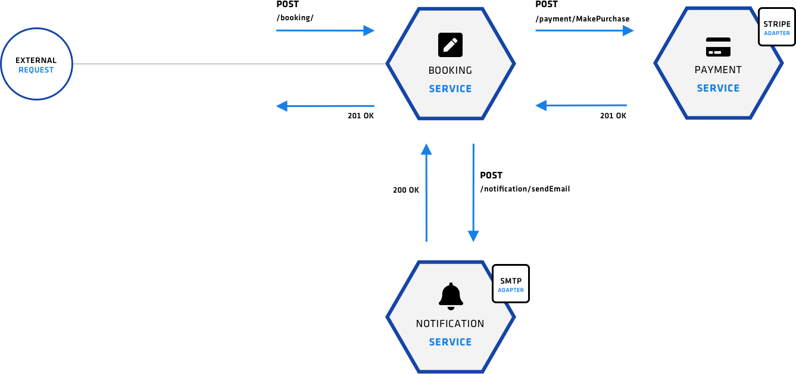

# Cinemas Microservice in Go (Project)



This project consist of the following components:

```
.
├── base_docker_image
├── booking-service
├── cinemas-db
├── deploy
│   ├── docker-compose
│   ├── hashicorp
│   │   ├── Vagrantfile
│   │   ├── deployment-files
│   │   ├── provision
│   │   │   ├── consul
│   │   │   ├── docker-config
│   │   │   ├── nomad
│   │   │   ├── scripts
│   │   │   └── vault
│   └── readme.md
├── movie-service
├── notification-service
└── payment-service
```

- 4 microservices written in Go
- 1 mongodb replica set cluster
- 2 deployment strategies
  - docker-compose strategy for local testing
  - hashicorp stack strategy for local cloud simulation testing


# How to use this project

This project has several components and deployment strategies, so please follow the instructions defined below in order to spin up this project.

- **[Initialize Environment with Hashicorp Vagrant](./deploy/hashicorp)** (Recommended)\
it creates an environment with almost all hashicorp stack, creates 2 vms to simulate two datacenters (dc1 and dc2) it installs nomad as the container scheduler, consul as the service mesh technology and vault as the secrets management tool and we do some configurations using terraform to have infrastructure as code (in this case is configurations as code e.g vault policies, consul policies, etc).

- [Run microservices with Docker Compose](./deploy/docker-compose) \
it only deploys the microservices in docker containers locally and it is best for debugging the applications.
